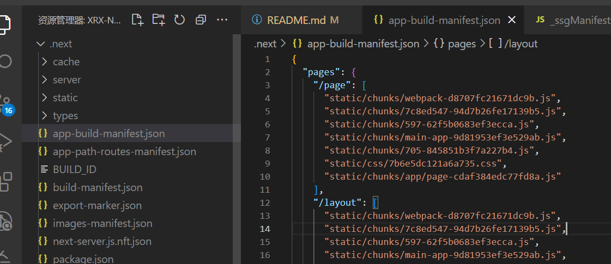

### nextjs13 开发踩坑指南

npm run dev：开发模式
npm run start：生产模式(即运行build后的代码)

### 使用的不便
- next13默认使用Turbopack，目前还不支持less和sass。


### next13新增的app router模式

- app router模式：
  - 默认app目录下所有都是服务器组件，可以使用node能力。
  - 如果组件要变成客户端组件(可以使用hooks已经浏览器api)，需要在组件内声明'use client'。
```js
'use client'
import { useEffect } from 'react'

export default () => {
  useEffect(() => {
    window.alert('hello')
  }, [])
  return (
    <div>
      <p>HOME PAGE is here!</p>
    </div>
  )
}
```


### next常用组件

- next/link：导航组件
```js
import Link from 'next/link'
<Link href="/about">
  <a>About Page</a>
</Link>
```

- Head：head组件  
- app router模式下，修改head只能通过导出metadata的方式。
```js
import Head from 'next/head'
<Head>
  <title>My page title</title>
  <meta name="viewport" content="initial-scale=1.0, width=device-width" />
</Head>
```

- next/router：路由组件（Pages Router）  
更多Pages Router信息<a href="https://nextjs.org/docs/pages">点击这里</a>
```js
import Router from 'next/router'
Router.push('/about')
```

- next/navigation：导航组件（App Router）  
更多App Router信息<a href="https://nextjs.org/docs/app">点击这里</a>
```js
import { useRouter } from 'next/navigation'
const router = useRouter()
router.push('/')
```

- dynamic：动态加载组件
```js
import dynamic from 'next/dynamic'

const DynamicComponent = dynamic(() => import('../components/hello3'))

export default () => (
  <div>
    <Header />
    <DynamicComponent />
    <p>HOME PAGE is here!</p>
  </div>
)
```


### CSR、SSR、SSG介绍

- CSR：客户端渲染，页面加载完成后，通过js动态渲染页面内容
- SSR：服务端渲染，页面加载完成后，服务端渲染页面内容，返回给客户端
- SSG：静态生成，页面在构建时，就生成了html文件，返回给客户端

**next默认打包后同时生成SSR和SSG两种文件，重点介绍ssr和ssg特点**

#### **SSR**

- 优点：SEO友好，首屏渲染快（只会在首次请求时，服务端渲染页面，后续页面的跳转，和csr一样，通过js动态渲染页面内容）
- 缺点：对服务器产生一定的压力。

#### **SSG**

- 优点：对每个路由页面，都会生成一个html文件，不会对服务器产生额外压力。适合内容不经常变动的页面。
- 缺点：不适合内容经常变动的页面，因为每次内容变动，都需要重新构建。


### **nextjs的预渲染**

- **在App Router模式下**  
  - 因为默认都是服务器组件，所以打包后所有ssg的文件，都自动进行了预渲染。

- **在Pages Router模式下**
  - getStaticProps：在构建时，会预渲染ssg页面，返回页面所需的props。（ssg）
  - getServersideProps：用于ssr页面，将浏览器的请求，转发到服务端，服务端渲染页面，返回页面所需的props。(csr)


### 在ssr环境下，react开发注意事项

服务端渲染，不支持window、document、localStorage等浏览器api，react的生命周期、react事件、ref等。因为服务端没有浏览器环境。如果要使用，需要在组件内声明'use client'。说明该组件是客户端组件，不会在服务端渲染。


### nextjs的seo和优化

- seo：
  - 普通用户电脑访问，Link组件会和spa一样，通过js动态渲染页面内容。
  - 爬虫访问，是禁用js的，此时Link组件的a标签，会直接跳转到页面，服务端渲染页面内容，返回给爬虫。

- 优化：
  - 尽量使用Link组件跳转页面，因为Link组件会做预加载(添加link标签，设置rel="prefetch")，提升页面跳转速度。（在app-build-manifest.json中，可以看到对应页面所需加载的js、css等文件）

    

  - （pages模式）尽量使用getStaticProps，因为getStaticProps会在构建时，预渲染页面，返回页面所需的props，提升页面加载速度，但这仅适用于内容不经常变动的页面。
    - ssg情况下会直接返回html文件。
    - ssr情况下直接拿缓存的json数据。

  - 动态导入：next/dynamic（可以将页面拆分成多个js文件，按需加载，提升页面加载速度。）
```js
'use client'
import dynamic from 'next/dynamic'
const Info = () => {
  // 将AsyncName拆分成单独的js文件，按需加载
  const AsyncName = dynamic(() => import('./AsyncName'))
  return (
    <div>
      <AsyncName />
    </div>
  );
}
```


### Suspense在next13中使用更加舒服

在spa中，Suspense只能用于动态加载组件，必须配合lazy使用。但在next13中，Suspense可以用于加载数据，只要是返回的是promise，都可以使用Suspense。

**spa**
```js
const LazyComponent = lazy(() => import('./LazyComponent'))

const LazyComponent = () => {
  return (
    <Suspense fallback={<div>Loading...</div>}>
      <LazyComponent />
    </Suspense>
  )
}
```

**next13**
```js
const LazyComponent = () => {
  const data = await asyncDate();
  return (
    <Suspense fallback={<div>Loading...</div>}>
      <div>{data}</div>
    </Suspense>
  )
}
```

### ssr简单实现原理

1、服务端将组件渲染成html字符串，返回给客户端。
  - renderToString：将react组件渲染成html字符串。

```js
import app from './app';
import Home from './share/pages/Home';
import { renderToString } from 'react-dom/server';
const content = renderToString(<Home />);
app.send(`
<html>
  <head>
    <title>ssr</title>
  </head>
  <body>
    <div id="root">${content}</div>
    <script src="/bundle.js"></script>
  </body>
`);
```

2、给客户端添加事件
  - hydrate：拿到打包好的js之后，客户端二次"渲染"
```jsx
import React from 'react';
import ReactDom from 'react-dom';
import App from './App';

ReactDom.hydrate(<App >, document.querySelector("#root"));
```

上述客户端代码打包成bundle.js连同html一起返回给浏览器，加载完成后 "二次渲染"。


3、服务器和客户端路由同步
  - BrowserRouter：客户端路由
  - StaticRouter：服务端路由


./routes.js
```jsx
import Home from './share/pages/Home';
import Login from './share/pages/Login';

export default [
  {
    path: '/',
    component: Home,
    exact: true,
  },
  {
    path: '/login',
    component: Login,
    exact: true,
  },
];
```

服务端路由
```jsx
import { StaticRouter } from 'react-router-dom';
import { renderToString } from 'react-dom/server';
import { renderRoutes } from 'react-router-config';
import routes from './routes';

const content = renderToString(
  // req.path是当前请求的路径
  <StaticRouter location={req.path}>{renderRoutes(routes)}</StaticRouter>
  );
app.send(`
<html>
  <head>
    <title>ssr</title>
  </head>
  <body>
    <div id="root">${content}</div>
    <script src="/bundle.js"></script>
  </body>
`);
```

客户端路由
```jsx
import { BrowserRouter } from 'react-router-dom';
import { renderRoutes } from 'react-router-config';
import routes from './routes';

ReactDom.hydrate(
  <BrowserRouter>{renderRoutes(routes)}</BrowserRouter>,
  document.querySelector('#root')
);
```
